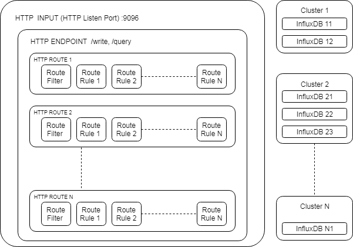

# influxdb-srelay


## Install from precompiled packages

Debian | RedHat |Docker
-------|--------|------
[deb](http://influxdb-srelay-rel.s3.amazonaws.com/builds/influxdb-srelay_latest_amd64.deb) - [signature](http://influxdb-srelay-rel.s3.amazonaws.com/builds/influxdb-srelay_latest_amd64.deb.sha1)|[rpm](http://influxdb-srelay-rel.s3.amazonaws.com/builds/influxdb-srelay-latest.x86_64.rpm) - [signature](http://influxdb-srelay-rel.s3.amazonaws.com/builds/influxdb-srelay-latest.x86_64.rpm.sha1)| `docker run -d --name=influxdb-srelay_instance00 -p 9096:9096 -v /mylocal/conf:/opt/influxdb-srelay/conf -v /mylocal/log:/opt/influxdb-srelay/log  tonimoreno/influxdb-srelay`

[![License][license-img]][license-href]

1. [Overview](#overview)
2. [Description](#description)
3. [Requirements](#requirements)
4. [Setup](#setup)
5. [Usage](#usage)
6. [Limitations](#limitations)
7. [Development](#development)
8. [Miscellaneous](#miscellaneous)

## Overview

Maintained fork of [influxdb-relay][overview-href] originally developed by InfluxData, with additions from https://github.com/veepee-moc. Refactored to add advanced data routing, transforamation and filtering.

**Be careful, we have deeply changed the configuration file syntax from both versions original from InfluxData and also from veepep-moc.**

## Description

This project adds an advanced routing layer to any HTTP based InfluxDB queries.

## Tested on

- [Go](https://golang.org/doc/install) 1.7.4 to 1.12
- [InfluxDB](https://docs.influxdata.com/influxdb/v1.7/introduction/installation/) 1.5 to 1.7 (2.x not yet supported)

Other versions will probably work but are untested.

## Setup

### Go

Download the daemon into your `$GOPATH` and install it in `/usr/sbin`.

```sh
go get -u github.com/toni-moreno/influxdb-srelay
cp ${GOPATH}/bin/influxdb-srelay /usr/bin/influxdb-srelay
chmod 755 /usr/bin/influxdb-srelay
```

Create the configuration file in `/etc/influxdb-srelay`.

```sh
mkdir -p /etc/influxdb-srelay
mkdir -p /var/log/influxdb-srelay
cp ${GOPATH}/src/github.com/toni-moreno/influxdb-srelay/examples/sample.influxdb-srelay.conf \
   /etc/influxdb-srelay/influxdb-srelay.conf
```

### Docker

Build your own image need for docker-ce > 17.05 ( or equivalent ee version )

```sh
git clone git@github.com:toni-moreno/influxdb-srelay
cd influxdb-srelay
docker build \
       --file Dockerfile \
       --rm \
       --tag influxdb-srelay:latest \
       .
docker run \
       --volume /path/to/influxdb-srelay.conf:/etc/influxdb-srelay/influxdb-srelay.conf
       --rm
       influxdb-srelay:latest
```

or

Docker pull our image.

```sh
docker pull tonimoreno/influxdb-srelay:latest
docker run \
       --volume /path/to/influxdb-srelay.conf:/etc/influxdb-srelay/influxdb-srelay.conf
       --rm
       tonimoreno/influxdb-srelay:latest
```

## Usage


### Architecture



Architecture description:

* __DB Backend__: A DB backend is a reference for each OSS influxDB individual instances.

* __InfluxCluster__: a set of `DB Backends` working together and the item to route http request to. 

* __HTTP Object__: Is an HTTP listener waiting for HTTP connections, each HTTP Object listens for user configured `HTTP Endpoints` or also administrative tasks `/health`, `/ping`, `/status` or `/ping`
* __HTTP Endpoint__: User configured endpoint (tipically `/query` or `/write` on InfluxDB 1.X data) to send "WR" or retrieve "RD" data. Each endpoint has an associated source format (Influx Line Protocol, Influx Query Language, etc). If one query match the user endpoint it begins to check for matching `Routes` in sequential order and only until one route matches.
* __HTTP Route__: An HTTP Route defines the way to handle the incomming HTTP request that matches the enpoint. The route is only applied if all its `Route Filters` matches and will be handled by each `Route Rule` in sequencial order. If any defined `Route Filters` match the HTTP request its evaluated by the next route.
* __Route Filter__: A way to define a condition over incomming HTTP or DATA parameters, when condition becomes true the route will be matched.
* __Route Rule__:  A rule is a way to handle incomming query or data. Rules could route over `InfluxClusters` as many times as it is needed, or data filtering and/or transformation, there is some rule "types" defined each one with its way to work, you can see config parameters descritptions on [example config](examples/sample.influxdb-srelay.conf)


### Configuration Examples

You can find some configurations in [examples](examples) folder.

#### A simple Read-Write HA load balancer

* [HA sample](examples/rwha-sample.influxdb-srelay.conf)

####  k8s multitenant

The following config enables user separate k8s namespaces labeled metrics on diferent databases with the namespace name (databases in the backends should be previously created)

* [Prometheus Multitenancy](examples/prom-multitenant.influxdb-srelay.conf)

#### Complex combination

* [Complex combined](examples/sample.influxdb-srelay.conf)


### HTTP Listener Administrative endpoints

#### `/ping`

This endpoint is a compatible InfluxDB /ping endpoint with ExtraHeaders.

````bash
curl -I  http://localhost:9096/ping
HTTP/1.1 200 OK
Content-Length: 0
X-Influx-Srelay-Version: 0.2.0
X-Influxdb-Version: Influx-Smart-Relay
Date: Wed, 22 May 2019 07:27:03 GMT
````
####  `/ping/<clusterid>`

````bash
#curl -I  http://localhost:9096/ping/mycluster
HTTP/1.1 204 No Content
X-Influx-Srelay-Version: 0.2.0
X-Influxdb-Version: Influx-Smart-Relay
Date: Wed, 22 May 2019 07:31:39 GMT
````

#### `/health`

This endpoint provides a quick way to check if the listener is working. 
Use it as health check for external load balancers

````bash
# curl -I  http://localhost:9096/health
HTTP/1.1 200 OK
Content-Length: 4
Content-Type: application/json
Date: Wed, 22 May 2019 07:23:03 GMT
````

#### `/health/<clusterid>`

This endpoint provides a quick way to check the state of all the backends for the 
selected cluster with its clusterid.
It will return a JSON object with the status of all backends defined on cluster: 

```json
{
  "status": "problem",
  "problem": {
    "local-influxdb01": "KO. Get http://influxdb/ping: dial tcp: lookup influxdb on 0.0.0.0:8086: no such host"
  },
  "healthy": {
    "local-influxdb02": "OK. Time taken 3ms"
  }
}
```

If the relay encounters an error while checking a backend, this backend will be reported with the associated error in the `problems` object.
The backends wich the relay was able to communicate with will be reported in the healthy object.

The status field is a summary of the general state of the backends, the defined states are as follows:
* `healthy`: all backends are OK
* `problem`: some backends but no all of them, return errors
* `critical`: all backends return an error

#### `/admin/<clusterid>` (work in progress)

Whereas data manipulation relies on the `/write` endpoint, some other features
such as database or user management are based on the `/query` endpoint. As
InfluxDB SRelay does not send back a response body to the client(s), we are not
able to forward all of the features this endpoint provides. Still, we decided
to expose it through the `/admin/<clusterid>` endpoint.

Its usage is the same as the standard `/query` Influx DB endpoint.

```
curl -X POST "http://127.0.0.1:9096/admin/mycluster" --data-urlencode 'q=CREATE DATABASE some_database'
```

Errors will be logged just like regular `/write` queries. The HTTP response
bodies will not be forwarded back to the clients.

#### `/status/<clusterid>` (work in progress)

This endpoint provides a quick way to get InfluxCluster Backends Data and statistics.(work in progress...) 

## Limitations

So far,this is compatible with Debian, RedHat, and other derivatives.

## Development

Please read carefully [CONTRIBUTING.md][contribute-href] before making a merge
request.

Clone repository into your `$GOPATH`.

```sh
mkdir -p ${GOPATH}/src/github.com/toni-moreno
cd ${GOPATH}/src/github.com/toni-moreno
git clone git@github.com:toni-moreno/influxdb-srelay
```

Enter the directory and build the daemon.

```sh
cd ${GOPATH}/src/github.com/toni-moreno/influxdb-srelay
go build -a -ldflags '-extldflags "-static"' -o influxdb-srelay
```

## Miscellaneous


[license-img]: https://img.shields.io/badge/license-MIT-blue.svg
[license-href]: LICENSE
[overview-href]: https://github.com/influxdata/influxdb-relay
[contribute-href]: CONTRIBUTING.md
